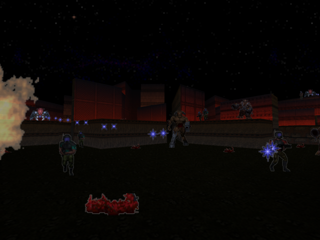

# Doom64-RTX

A native PC port of **Doom 64**, built from [Erick194's DOOM64-RE](https://github.com/Erick194/DOOM64-RE)
reverse-engineered source, with:

- **SDL3** for windowing, input (keyboard, mouse, gamepads) and audio output
- a **Vulkan 1.1+ renderer written in Rust with [ash](https://github.com/ash-rs/ash)**
- an optional **ray traced world renderer** (Vulkan `VK_KHR_ray_query`) you can switch on and off
- an **OpenGL 3.3 fallback** renderer (Rust, [glow](https://github.com/grovesNL/glow)) used automatically
  when Vulkan is not available
- targets **x86-64 Windows and Linux**

The ray tracing approach takes its ideas from [doom64-rt](https://github.com/jlrouzies-fr/doom64-rt)
(real light sources instead of painted light, sector light colours kept as the art direction,
temporal accumulation and denoising). No code is shared with that project.

> **You need your own copy of Doom 64.** No game data is included or downloaded.



## Download

Download the latest milestone from [GitHub Releases](https://github.com/crusader290/Doom64-RTX/releases). Archived builds are in [`releases/`](releases/):

| File | Platform |
|---|---|
| `doom64rtx-0.5.4-windows-x86_64.zip` | Windows 10/11 x86-64 (`SDL3.dll` included) |
| `doom64rtx-0.5.4-linux-x86_64.tar.gz` | Linux x86-64, glibc 2.39+ (`libSDL3.so.0` included) |

Extract, put your ROM next to the executable, run `doom64rtx`. CI artifacts from
`.github/workflows/build.yml` are built the same way.

## Status

| Area | State |
|---|---|
| Game code (DOOM64-RE) compiled for 64-bit PC | working |
| ROM auto-detection | working |
| OpenGL 3.3 renderer | working |
| Vulkan raster renderer | working |
| Vulkan ray traced world | preview (F10 or Options > Graphics) |
| Resource packs (pk3/folders: PNG textures, sprites, RT materials) | working |
| Sound and music (WESS + software N64 synth) | working (music, effects, reverb) |
| Windows build (MinGW-w64) | working (tested under Wine: OpenGL and Vulkan) |
| Save/load anywhere (pause/title menu, F5/F9, auto save) | working |
| Mouse look, jumping, weapon keys, aim down sights, kick | working |
| 30 / 60 / 120 fps (interpolated; game logic stays 30 Hz) | working |
| Options > Graphics / Gameplay, F7 debug page | working |
| Native save/load, quicksave and autosave | working; console storage/password menus removed |
| 4:3 / 16:9 (Settings › Graphics › Aspect Ratio) | working: wider field of view, HUD and menus keep their proportions |
| Log file + crash reports | working, on by default |

See [PROJECT_CONTEXT.md](PROJECT_CONTEXT.md) for the detailed log and
[PORT_MANIFEST.md](PORT_MANIFEST.md) for per-file status.

## Playing

1. Put your Doom 64 ROM (`.z64`, `.n64` or `.v64`, any byte order) in the folder you start the
   game from, or next to the executable. Supported dumps: USA, USA Rev 1, Europe, Japan.
   The ROM is detected automatically; you can also pass `-rom <file>` or set `rom=` in the ini.
   Pre-extracted `DOOM64.WAD/.WMD/.WSD/.WDD` files in the same places also work.
2. Run `doom64rtx` (`doom64rtx.exe` on Windows).

### Command line

| Option | Effect |
|---|---|
| `-rom <file>` | use this ROM image |
| `-vulkan` / `-gl` | choose the renderer (Vulkan falls back to OpenGL automatically) |
| `-rt` / `-nort` | ray tracing on / off |
| `-fullscreen` / `-window` | display mode |
| `-widescreen` | 16:9 for this run |
| `-nolog` | do not write doom64rtx.log |
| `-nosound` | no sound output |
| `-pack <file>` | load a resource pack (pk3 or folder); repeatable |
| `-set <name> <value>` | set any ini setting for this run |

### Keys

| Key | Action |
|---|---|
| W / S, Up / Down | forward / back |
| Left / Right, mouse | turn (mouse also looks up/down) |
| A / D | strafe |
| Ctrl, left mouse | fire |
| Right mouse | aim down sights |
| E, middle mouse | use |
| Space | jump |
| V, mouse button 4 | kick |
| 1 - 8 | select weapon |
| Shift | run (walk with Always Run on) |
| Tab | automap |
| Q / mouse wheel | previous / next weapon |
| Enter / Backspace | menu confirm / back |
| Esc | menu (Save Game / Load Game in the pause menu) |
| F5 / F9 | quicksave / quickload |
| F7 | debug page (god mode, noclip, give all, stats overlay, ...) |
| **F10** | **toggle ray tracing** (Vulkan, RT-capable GPU) |
| F11, Alt+Enter | fullscreen |
| F12 | screenshot |

Gamepads use the standard controller layout: left stick moves and turns, right stick turns, right
trigger fires, shoulders strafe, A/B confirm and back, X uses, Y opens the map.

### Settings (`doom64rtx.ini`)

Read from next to the executable if present (portable install), otherwise from the user's
preference directory (`%APPDATA%\Doom64RTX\Doom64RTX\` or `~/.local/share/Doom64RTX/Doom64RTX/`).

```ini
renderer = vulkan        # vulkan | opengl
raytracing = 1           # ray traced world when the GPU supports it (F10 toggles)
widescreen = 0           # 1 = 16:9 (also in Settings > Graphics > Aspect Ratio)
brightness = 50          # starting value of the game's Brightness option (0..100)
log = 1                  # write doom64rtx.log
sound = 1                # sound and music
fps = 120                # 30, 60 or 120 (interpolated)
mouselook = 1            # also: invert_mouse, always_run, autoaim, crosshair, jump,
ads = 1                  #   weapon_bob (0-100), fast_weapons, gore, autosave

audio_rate = 44100       # synth output rate (the N64 used 22050)
rt_spp = 1               # rays per pixel for AO / bounce light
rt_bounces = 1
rt_denoise = 1
rt_light_scale = 1
fullscreen = 0
width = 1280
height = 960
vsync = 1
mouse = 1
mouse_sens = 1
gpu_index = -1           # -1 = pick automatically
validation = 0           # Vulkan validation layers
```

Save games (`save0.d64s` ... `save8.d64s`; 7 = quick, 8 = auto) are stored in the preference directory.
Settings changed in game (F10, F11, Aspect Ratio) are saved; command-line options are not.

### Resource packs (texture and sprite replacements)

Put `.pk3` (zip) files or folders into a `packs/` folder next to the executable, in the
folder you start the game from, or in the preference folder; or list them in the ini
(`packs = a.pk3;b`) or with `-pack <file>`. Any PNG whose file name equals a Doom 64 lump
name replaces that texture or sprite, e.g. `textures/C1.png` or `sprites/SKULA1.png`
(GZDoom-style folders work; higher resolutions are fine). Packs loaded later win.
Turn them off in Options > Graphics > Texture Packs (`respacks = 0`).

**Ray tracing materials.** Packs can also carry doom64-rt style material maps next to (or
instead of) the colour image: `NAME_orm.png` (occlusion, roughness, metallic), `NAME_n.png`
(normal map) and `NAME_e.png` (emissive), plus defaults in `rt/data/*.json`
(`textureName`, `roughnessDefault`, `metallicDefault`, `emissiveMult`). They are used by the
ray traced renderer only (normal-mapped lighting, specular highlights, glowing surfaces).
Release builds ship these in `packs/` and load them automatically: the doom64-rt RT
materials (`doom64rt-materials.pk3`, made by `tools/pack_materials.py`) and the doom64-rt lost
soul and fireball sprite packs. From source, run with
`-pack addons/doom64-retribution/Retribution-RT-Materials` or copy that folder into `packs/`.
With the materials loaded, things whose sprite has a doom64-rt light colour (items, fire,
projectiles, barrels) and walls/flats with emissive maps cast coloured light when ray tracing.

### Logs and crash reports

Every run writes `doom64rtx.log` next to `doom64rtx.ini` (the previous run is kept as
`doom64rtx.old.log`): system info, settings, ROM, renderer and GPU, map loads, warnings,
renderer errors, a stats line every minute, and on a crash the signal or exception with a
backtrace and what the game was doing. Please attach it when reporting a problem.

## Building

Shortcut for contributors: `tools/setup_env.sh` (dependencies, prebuilt SDL3), then
`tools/check.sh linux win` (incremental builds with short error summaries; full logs in
`build-logs/`) and `tools/smoke.sh` (headless runtime test, needs your ROM).

Requirements: CMake 3.20+, a C11 compiler (GCC, Clang or MSVC), Rust (stable) with `cargo`,
and SDL3 (found on the system, otherwise downloaded and built automatically).
`glslangValidator` is only needed if you change the Vulkan shaders (compiled SPIR-V is checked in;
run `tools/compile_shaders.sh`).

### Linux

```sh
# Debian/Ubuntu build dependencies for SDL3
sudo apt install build-essential cmake ninja-build libx11-dev libxext-dev libxrandr-dev \
    libxcursor-dev libxi-dev libxss-dev libwayland-dev libxkbcommon-dev libegl-dev \
    libgl-dev libasound2-dev libpulse-dev libdecor-0-dev
cmake -S . -B build -G Ninja -DCMAKE_BUILD_TYPE=Release
cmake --build build
./build/doom64rtx
```

### Windows

Experimental (CI runs it, not yet verified) with Visual Studio 2022 and Rust (`x86_64-pc-windows-msvc`):

```bat
cmake -S . -B build -G "Visual Studio 17 2022" -A x64
cmake --build build --config Release
```

Supported: cross-compile from Linux with MinGW-w64 (`rustup target add x86_64-pc-windows-gnu`):

```sh
cmake -S . -B build-win -G Ninja -DCMAKE_BUILD_TYPE=Release \
      -DCMAKE_TOOLCHAIN_FILE=cmake/mingw-w64-x86_64.cmake
cmake --build build-win
```

Copy `SDL3.dll` next to `doom64rtx.exe`.

### Build options

| Option | Default | Meaning |
|---|---|---|
| `D64_WITH_AUDIO` | ON | build the WESS sound system (OFF = silent stub) |
| `D64_NULL_RENDERER` | OFF | headless renderer for tests (no Rust needed) |
| `D64_FETCH_SDL3` | ON | download SDL3 if it is not installed |

## How it works

The original game builds Nintendo 64 display lists for the RSP/RDP. This port keeps that code
and replaces the hardware:

```
DOOM64-RE game code ──► display lists (F3DEX encoding, 64-bit safe)
        │                        │
src/port: SDL3 main loop,        ▼
ROM loader, input, pak    src/gfx/gbi.c: RSP/RDP interpreter
                          (matrices, TMEM, texture decode, combiner/blender state)
                                 │  d64gfx.h (C ABI)
                                 ▼
                 renderer/ (Rust): Vulkan (ash) raster ── optional ray traced world
                                   OpenGL 3.3 fallback (glow)
```

The N64 colour combiner and blender are emulated in a shared GLSL routine, so menus, HUD,
sky and world look like the original. In ray traced mode the 3D world is traced instead of
rasterised and composited in the original draw order.

## Testing without a GPU

Mesa's software drivers (llvmpipe for OpenGL, lavapipe for Vulkan including ray queries) run the
game under Xvfb. Test hooks such as `D64_SHOTS`, `D64_QUIT_AT` and `D64_FIXED_TIMESTEP` are
described in [PROJECT_CONTEXT.md](PROJECT_CONTEXT.md).

## Credits and license

- Doom 64 reverse engineering: **Erick Vásquez García (GEC)** and contributors, DOOM64-RE (GPLv3).
  See [docs/DOOM64-RE-CONTRIBUTORS.md](docs/DOOM64-RE-CONTRIBUTORS.md).
- Ray tracing reference: [doom64-rt](https://github.com/jlrouzies-fr/doom64-rt) by jlrouzies.
- Doom 64 © id Software / Midway. This project contains no game assets.

Licensed under the **GNU GPL v3**, the same as DOOM64-RE. See [LICENSE](LICENSE).

## One-command builds

Run `bash build.sh` on Debian/Ubuntu to download missing dependencies and build
Linux and Windows x64. Select a target with `bash build.sh linux` or
`bash build.sh win`. System packages may need sudo; SDL and dependency build
outputs stay in `build-deps/`. Existing CMake FetchContent and Cargo download
SDL3 and renderer dependencies when needed.

On Windows, run `build.bat`. It downloads and verifies a portable official MSYS2
archive into `build-deps/`, installs the MinGW compiler, CMake, Ninja, Rust and
SDL3, then builds `build-native-win/doom64rtx.exe`. No system-wide PATH changes
are required. `build.bat -SetupOnly` installs dependencies without compiling.
Linux builds from Windows require Ubuntu/WSL and `bash build.sh linux` there.
Network access is required for first-time downloads. Full logs from cross builds
are in `build-logs/`; native Windows tools print diagnostics directly.
## Native combat and add-on ports (0.5.3)

Default combat uses faster weapons, a stronger timed kick, recoil/inertia animations, impact feedback, heavy gore and attributed PCM sound upgrades. All modern gameplay effects are disabled for demo playback/recording. Settings > Key Bindings captures 12 primary keyboard actions, swaps conflicts and offers Reset Bindings. Arrow/Enter/Esc, number weapon slots and function shortcuts stay fixed.

The release loads one packs/doom64rtx-visuals.pk3. It includes compatible sprite/ceiling art, RT materials, boot frames, sounds and selected native add-on definitions. Native adapters port persistent colored blood, a reactive face HUD, bounded poison/lava effects and a flashlight battery/HUD; F toggles a shadowed cone in the RT renderer. Battery charge resets on level/save loads. General GZDoom scripts and replacement maps require conversion; see [the capability matrix](docs/ADDON_COMPATIBILITY.md).

Blood Lifetime and Blood Limit control new stains (0 means permanent, hard cap 128). Native Add-ons disables the behavior ports. Both imported audio and combat animation have independent switches. Imported assets retain upstream attribution and licence status.

Face HUD and Liquid Effects have independent settings. Poison bubbles map to native slime; lava sparks require compatible HLAVA/D64LAVA textures. At most 48 cosmetic particles and eight small lights are active. `-warp 7 -skill 1` starts a map directly (maps 1..32, skills 1..5), without persisting the startup choice.
